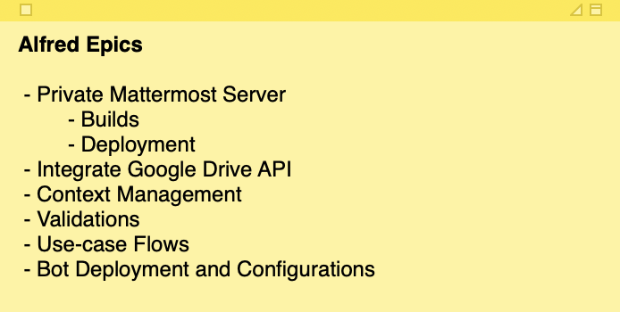
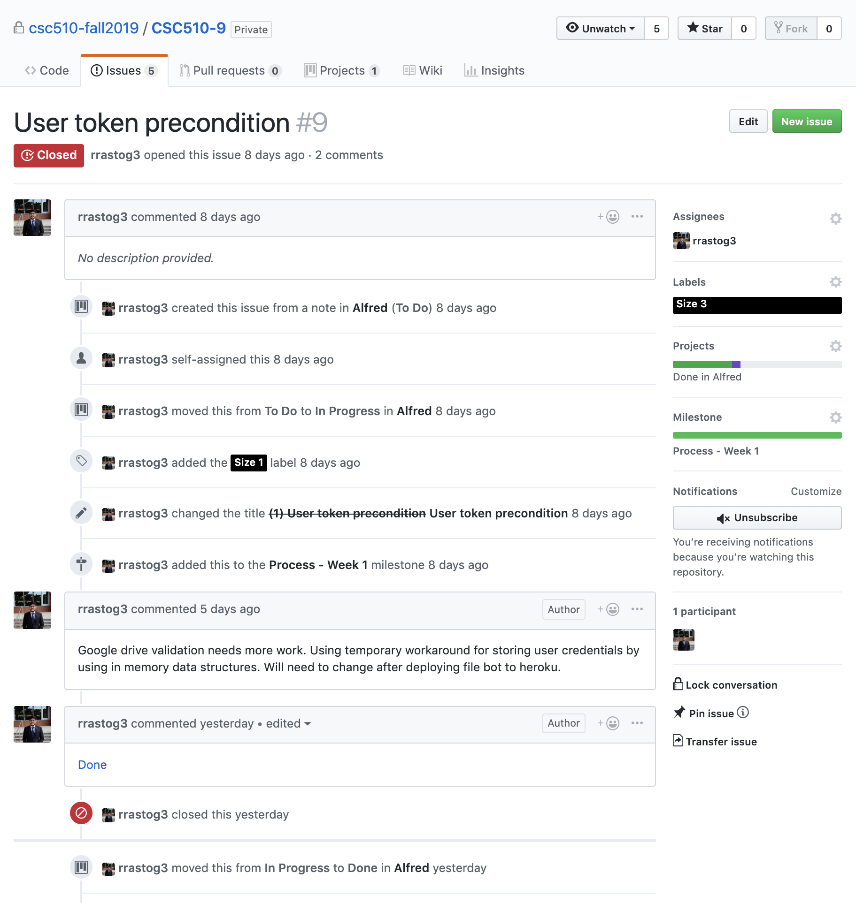
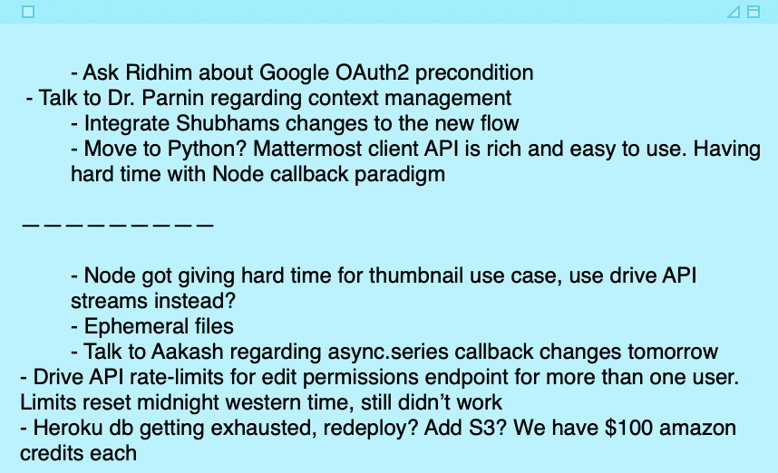
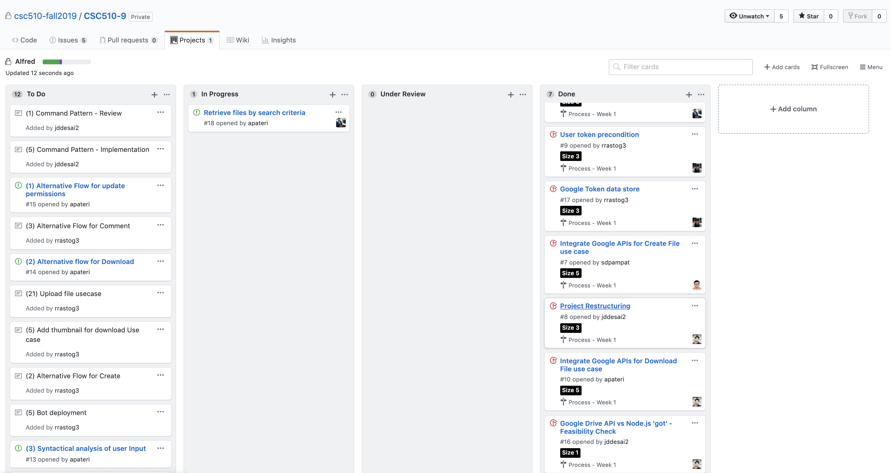
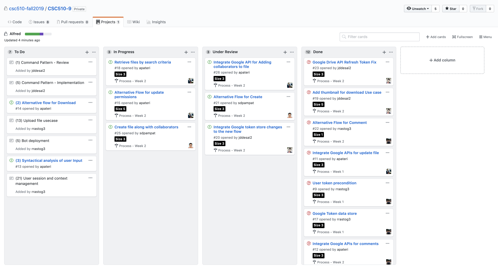

## Process

### Defining Tasks and Labels

 - **Epics**: We defined our Epics right after the Design Milestone.
 
 
 
 - **Tasks**: The first thing we did for the Process Milestone is break down the epics into tasks. We added the tasks as notes to the Alfred Project Board. While adding the tasks, we added a rough estimate inside the paranthesis () as it was a requirement. The final effort estimation was done using the Sprint Planning meeting.
 
 - **Labels**: For story points, we created `Size` labels `{1, 3, 5, 8, 21}`. We only used 21 for the Epics that were not broken down. We also created two milestones `Process - Week 1` and `Process - Week 2` to identify sprints.
 
 - [**Project Board**](https://github.ncsu.edu/csc510-fall2019/CSC510-9/projects/1): We used the GitHub project board as an issue tracker. The board was populated with all the tasks as notes in the beginning.

### Development Flow

 - Pick a task
 - Convert the task to an issue
 - Assign appropriate `Size` label as discussed in the sprint planning
 - Add the `Milestone` label
 - Move the card from `To Do` swimlane to `In Progress`
 - Once the task is finished, move the task from `In Progress` to `Under Review`
 - This task is then reviewed by any one team mate* and review comments are added if any
 - Once reviewed, the issue is closed and moved to `Done`

*We tried to follow this but due to different course schedules and timelines, sometimes the developer who worked on the task closed the issue if it was not reviewed for some time. If it was a small change, the developer himself added necessary comments and closed the issue.

**The activity on a task can be seen in the screenshot below dated October 26, 2019**

 
### Meetings

#### Sprint Planning

We conducted a Sprint Planning meeting at the beginning of both the sprints. To estimate the effort, we used calculator in our mobile phones instead of Planning Poker; on the count of three, we raised our phones with the story points typed in the calculators. We had major conflicts for a couple of tasks, one of them was Context Management. We discussed on the conflict and contradicting opinions but could not come to a consensus. As a solution to this issue, we decided to establish a **Baseline** which is a task worth 1 story point. We used this baseline as a relative effort and assigned the story points. Baseline for our project is: **Smallest alternate flow for any use-case. For instance if a user provides an invalid filename, Alfred should post a reply on the incoming channel with an appropriate message.**
 
#### Scrum 

We could not conduct a daily scrum meetings so we conducted bi-weekly meetings. We discussed on what issues we faced and how we can collaborate and pick tasks in a way that there are fewer conflicts. Also, we did not have a dedicated Scrum Master and all four team members worked as individual contributors because there was enough work to do in less time.

Some notes that I took during the scrum meeting, including clarifying questions and things to discuss later, are as follows. Notes moved to right are the ones resolved or discussed.

 
#### Retrospective

At the end of first sprint we conducted a retrospective meeting. The agenda of this meeting was to understand _What went wrong?_, _How can we avoid similar problems in upcoming sprint?_ Some isses we faced are:

 - Even after coming to a consensus on the effort required for a task, we misjudged effort for some tasks by a very big margin. For instance the Google Authoriaztion story was hugely under estimated.
 
 - We started working on the tasks independently and had scrum meetings every 3 or 4 days. We felt that it would have been better if we had more frequent scrums. So for second sprint, we had 5 scrum meetings.

 - We did not segregate inter-dependent tasks properly. For example if a developer is working on download files use case, listing files for reference is a sub task. We started in a way that one developer is working on list files while other is working on download file. Unless the list file task is completed, download cannot work because of the way Google Drive API works.
 
 - We used dummy data as a workaround for the problem above but then had a hard time merging the changes, which leads to the last and the most important issue we discussed in the retrospective meeting - We did not decide on the common coding practices, naming conventions, file and directory segregations which led to recursive refactoring of code. We had a hard time integrating stuff even with SOTA version control systems.
 
### Sprint 1

At the end of first iteration, our board looked something like this

### Sprint 2

We are not done with the final sprint yet but as of today (November 7, 2019), our board looks something like this

## Practices

The following **core practices** were integrated in our software development process:

- **Pair programming** : We were able to integrate this core practice successfully into our software development process.

  - Whenever a new stub(code) was to be added for a user story, the team members worked together in pairs. One member acted as the driver and the other acted as a navigator. This practice turned out quite fruitful for us. We were able to deliver good quality code in a way more effiecient manner than before. 
  - Another added advantage was that, pair programming facilitated better communications among the team members, kept team memebers informed about each other's work.
  
- **Weekly planning** : This was another core practice that was integreated in our software development process. The weekly planning meetings enabled us to:
 
  - Discuss if any new information/concerns popped up during the software developement process.
  - Review the user stories that were completed.
  - Determine the work that needs to be taken next and also estimite the project timeline.
  
The following **corollary practice** was integrated in our software development process:

- **Shared code** : This **corollary practice** came in quite handy during our software development process. 

  - We as a team were able update/change any part of the code base if required, this facilitated proper end-to-end review and implementation of all our use cases.
  - This corallary practice helped instill a sense of collective responsibility and accountability in the team.

## Consistency

The tasks were distributed evenly between sprints. Sprint wise distribution of tasks can be seen in the image below

| Process  | Tasks assigned | Tasks completed | Story Points Finished |
| ------------- | ------------- | ------------- | ------------- |
| Sprint 1  | 8  | 7 | 26 |
| Sprint 2  | 9  | 7 | 19 |

