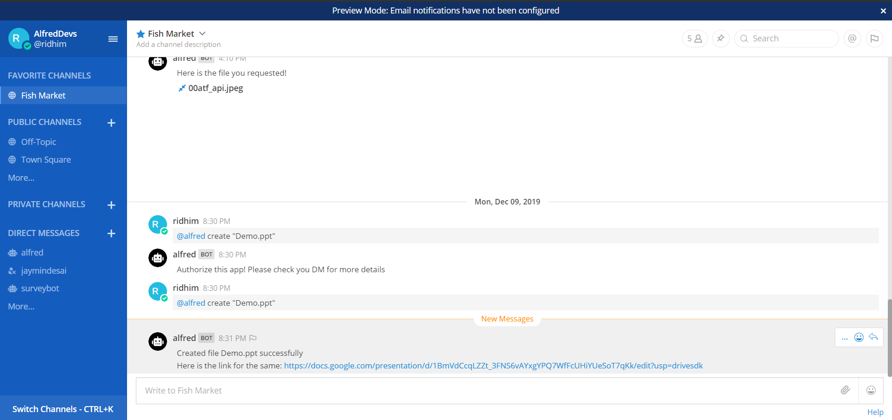
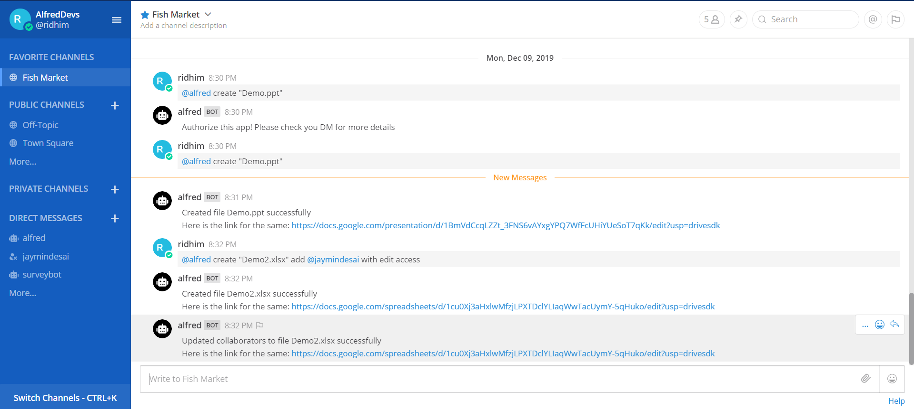
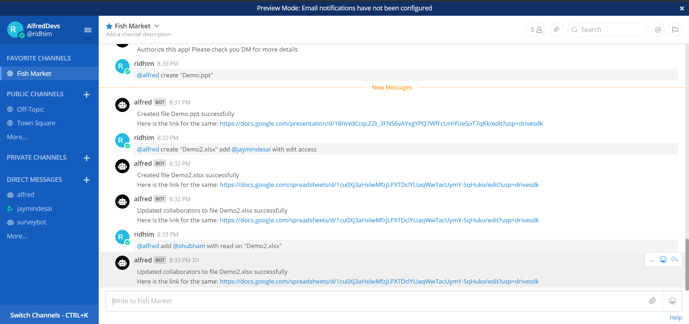
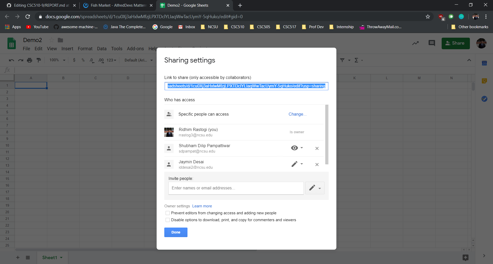
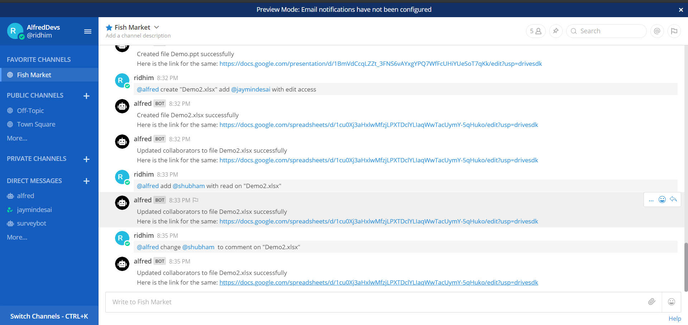
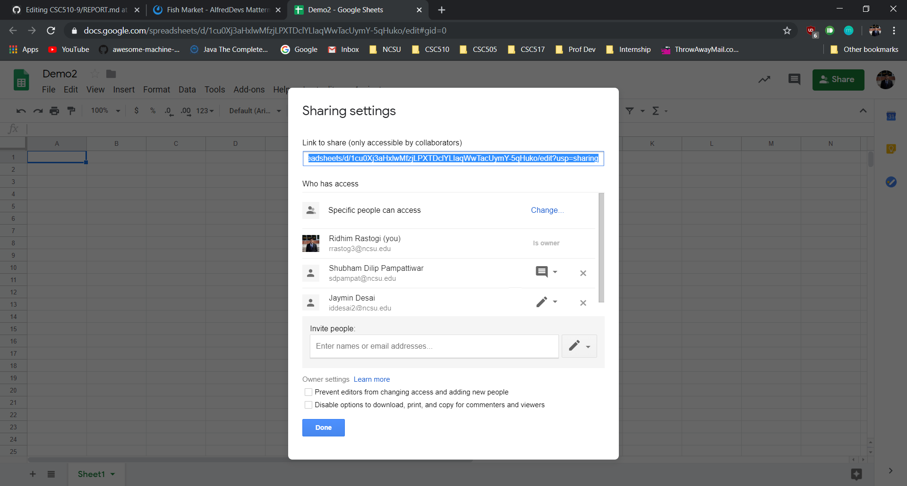
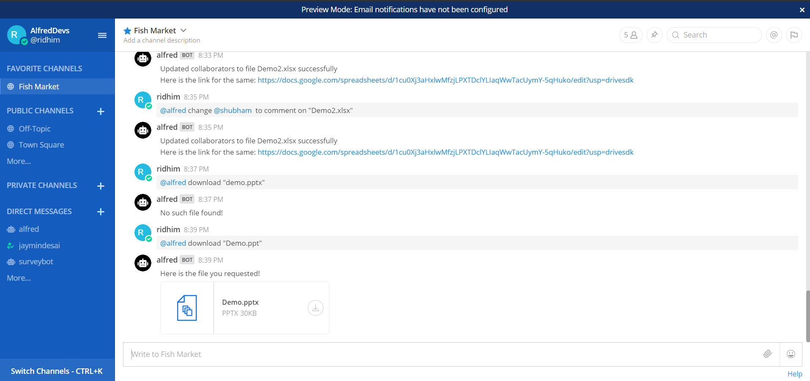
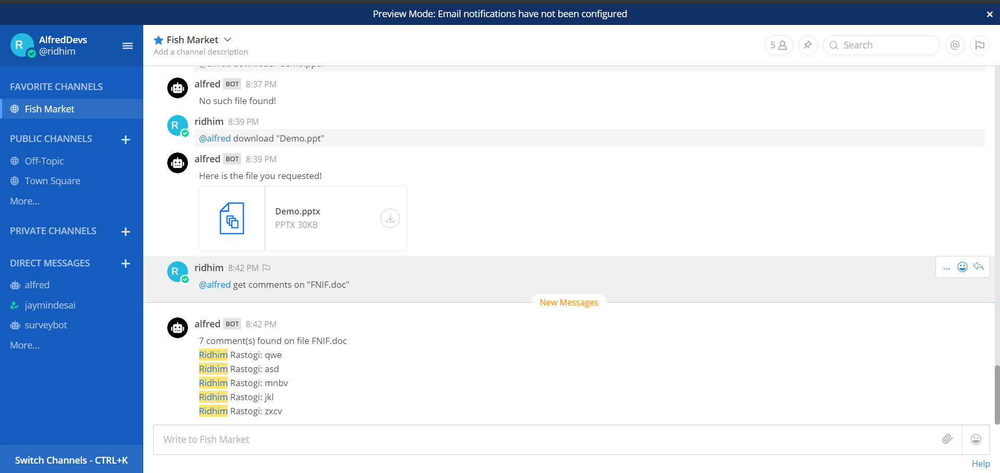

## Problem and Proposed Solution

Scenario: As a scrum team member, you are assigned a task by your scrum master to consolidate Minutes of 
Meetings (MoM) from the retrospective that your team conducted yesterday for the sprint that just ended. Scrum master wants to keep track of MoMs you gather in real-time, and at the same time also wants to comment on the notes posted by different team members. Once everyone is done posting their notes, you are asked to send the document to all the team members including the product owner.

Sounds easy? We don't think so!

Everytime you share a file with one of your teammates, it involves a cat and mouse game of hunting for their email ids, 
managing permissions and keeping track of the changes made to the file. Working on shared documents often leads to 
dependencies between team members as they have to manually check for comments and updates to the documents. This leads to 
delays and introduces overheads in the development lifecycle. A very simple task such as dwnloading a file from your Google 
Drive and sharing it with your colleague on a collaboration platform like Mattermost requires multiple clicks, keystrokes, 
tab and context switching; trust us, enough overhead to grab hold of that amazing productivity scores and introduce long flat 
horizontal steps in that perfect burndown chart.

### **Sharing and managing shared files is indeed difficult...**

Consider the scenario mentioned above. The typical steps involved can look something like this:

 - Take some time to loose that frown off your face
 - Assuming your scrum master sent this message to you on Mattermost, go to Google Drive
 - Wish for your browser to remember the credentials for your email account
 - Create a new Google Docs file
 - Try sharing it with your team members; Oops! you need to name it first. Give it a name, "retro-notes-s8"
 - Once you do that, it asks you to mention the email addresses of users you want to share that file with
 - After adding all the names (assuming you dont want to share the file with entire organization but just your team members), 
 notify everyone that they must have received a link via email
 - Make sure only the team members have edit permissions
 - Give just comment permission to the scrum master so he/she couldn't edit your notes ;)
 - Once all the team members have finished posting their MoMs, repeat steps 1-3 again.
 - Search and open the file
 - Export the document as a .doc or .docx file
 - Go back to Mattermost and upload this file on the team channel

Phew!! See, we told you it is not as easy as it sounds BUT...

What if you never had to leave Mattermost to **create** "retro-notes-s8.doc" on your Google Drive? What if you never had to look for 
all those email addresses because their **@Mattermost** handles was all you needed? What if you could just **add** everyone 
in your team as collaborators at the time of creating this doc right away with **edit** permissions? What if you could **update** the permissions for the scrum master to **comment** by typing just 4 words? What if you could **download** this doc on your team's channel without going anywhere? What if you had someone (**Alfred, the FileBot**) to do all this for you? What if you just had to _authorize_ Alfred _once_ using a single click, to perform these tasks on your behalf? What if you never had to loose that frowny face because Alfred didn't let you make one in first place?

This is exactly the solution we are proposing with **Alfred, your very own File Butler!** We have created a short [`video`](https://drive.google.com/file/d/1O2kYCTakZoHZc5ZsZX--Qsdbpt-AxwFo/view)
that tries to portray a similar setting using more than just plain text and shows Alfred in action.

## Primary Features

### Creating a file on google drive

1. Creating a supported file without any collaborators



2. Creating a file with collaborators



### Updating file permissions

1. Adding a new collaborator to a file





2. Changing permission of an existing collaborator





### Downloading a file



### Fetching comments on a file




## Reflection - Development Process & Project

Considering both the aspects, development process and project overall, we found few things that really helped and at the same time things that we could have done better.

### Things that helped

#### Brainstorming

What we think we did best is gave a lot of thought to answer this question: _"what problem we are going to solve?"_ We had hours long healthy debates and discussions to arrive at a common ground. We decided to tackle the issues faced by developers or people working in an enterprise setup in general when it comes to sharing files and keeping track of changes on shared files. 

We noticed that Dr. Parnin asked many students during the final presentations that whether they will be using their bot or did they use it during the development process. To be very honest, now that we have Alfred in production, a bot that can talk to Google Drive for us, we do use it in our daily routine. I download at least 3 files everyday using Alfred. I created a file or two this morning to take notes for the final project meetings of other subjects. It's always a special feeling when we solve a real problem no matter how small it is.

#### Mocking

We mocked the third-party API calls using Nock, a Node.js framework that we used hands-on during one of the workshops. We had lots of actual Google Drive integration work left at the time when BOT milestone was due. The only way we could have completed the Bot Interations was using mock data. Mocking the API calls using Nock was unexpectedly fast and fairly straight forward but it took some time to create mock data. This helped everyone finish their usecase flows in time. Our key takeaway from this is that mocking might take some time depending on the project and design of external APIs but it helps separate concerns and allows faster development in general.

#### Scrum-Ban

For our project, in PROCESS milestone, we had to do two things:

  - Improve the previously written usecase flows with better bot interactions and error handling
  - Integrate Google Drive API calls in place of mocked API calls for all the usecases

The former is kind of an enhancement task which suits Kanban methodology while the later requires delivering work fast, in increments which suits Scrum methodology. This made the our case an ideal candidate for Scrum-Ban!

We tried to follow Scrum as much as we can, as prescribed in the Agile Manifesto. We broke down bigger tasks in a Scrum manner which helped us deliver small working flows incrementally and regularly. For the bug/review fixes, we sometimes created a new task on the fly, a-la Kanban and prioritized it. For example, this image below represents the details for a task that was added to the Sprint in between, after the Sprint planning meeting. Had it been **just** Scrum, this might have been a part of next Sprint's backlog.


#### Pair & Mob Programming

We did a lot of Pair Programming as a part of this project. Most of the times, we sat together and did Pair Programming. But sometimes when the issue a pair is working on is a previously encountered problem or a common problem, both the pairs would start working on that issue. There were some problems which were solved quickly if all of us worked together on it. For example, when uploading a file on Mattermost, it expects a `ReadStream` created from file and we were passing in the BufferedStream. Nowhere in the Mattermost documentation it is mentioned that it requires a ReadStream. We tried to search the error message on the Mattermost Server repository on github but the messages were part of a generic locale translation file. We then tried to search the file usages and somehow figured that it requires a ReadStream. In all this, one of us had prior experience with GoLang which helped and one of us knew that finding file usage on GitHub is very easy using a ketbord shortcut `t`. One of us knew that Postman can be used to generate code. We had a POST request window open in Postman so it was very easy to figure out how to create a ReadStream in Node.js. None of us have worked enough on Node.js and we didn't even StackOverflow once. All four of us mobbed for 30 minutes to get this working.

### Things that could have done better

#### Establish Standards & Practices

We should have decideed on the coding practices within the team before starting the development phase. We had to go through a phase of integration hell when we had very little time to spare. We did conduct reviews but the process was not stringent enough. 

#### Unit Tests & Coverage

We could have added more unit tests. We understand the importance of TDD and starting development of a tiniest feature with a failing test case. We should have followed this from the very start but now that we didn't, this is something that can be improved.

#### Breaking Down Tasks

One of the challenging things in this project from the development perspective was to segregate/break-down interdependent tasks. This seemed to be a minor problem during Sprint-1 but we did face issues, nearing the end of Sprint-2. For example if a developer is working on _download file_ usecase, listing files for reference is a sub-task. We started in a way that one developer is working on _list files_ while other is working on _download file_. Until the _list file_ task is completed, _download file_ cannot work because of the way Google Drive API works.

What we think could be improved is to investigate more on the dependent APIs and also **spend more time in breaking down tasks**. We didn't think through some usecases in and out. We faced a similar problem with _create file_ and _update permissions_/_add collaborators_ usecase.

## Limitations

The following are the limitations of our file bot(Alfred):

* Alfred is currently available only for the Mattermost platform.
* Alfred can perform file operations only on limited number of file types.
* Alfred can perform file operations solely on the files of Google drive.


## Future Work

* **Add all Channel Members to a Document**: Currently, Alfred does not allow user to add all the members present in the channel, as a collaborator to a particular document in one shot. Alfred should support the said usecase through the command ```@alfred add @all to "report.doc"```.

* **Natural Language Processing and Understanding**: Presently, Alfred uses rule-based parsing of user commands to perceive the query intent. Natural language processing techniques is to be incorporated in Alfred, so that it can respond to a variety of input text rather than serving a fixed set of pre-defined user queries.

* **Support for Different Platforms**: Alfred is currently functionally coupled with Mattermost and Google Drive. Alfred support is to be extended for different file storage and synchronization services like oneDrive, DropBox, etc., and various messaging platforms such as Slack, WhatsApp Business, etc. 
